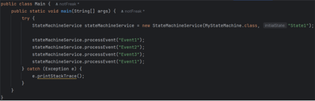
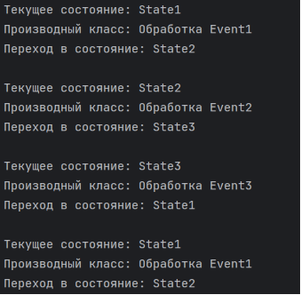
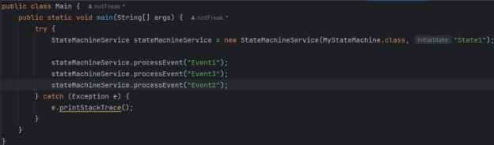
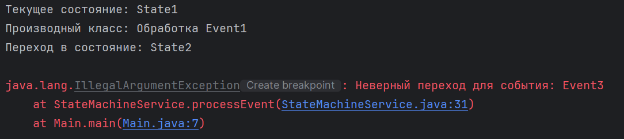



**Лабораторная работа №2**

**по дисциплине «Инжиниринг программного обеспечения»**

Рефлексия и аннотации.

Факультет: АВТФ

Группа: АВТ-141

Студенты: Кенин Е.Д., Половин Н.В.

Вариант: 9

Преподаватель: Романов Е.Л.

**Содержание**

[1.	Описание работы	3](#_toc179645839)

[2.	Описание паттернов	4](#_toc179645840)

[3.	Функциональное описание классов	5](#_toc179645841)

[4.	Результаты работы	7](#_toc179645842)

[5.	Вывод	9](#_toc179645843)

 # **1.Описание работы**
С использованием средств рефлексии разработать универсальный сервис, применимый для объектов произвольного класса. Передается имя класса или его описатель класса Class. Разработать универсальный сервис, использующий аннотированные элементы класса. 

Класс – конечный автомат с вызовом методов, прикрепляемых к переходам и состояниям по имени. В описании автомата перечисляется список дуг в виде входное состояние – входной символ – состояние перехода – имя метода, вызываемое при переходе. Сами методы реализуются в производном классе для класса-автомата
# **2.Описание паттернов**
В данном приложении используются следующие паттерны проектирования:

**Template Method**: В базовом классе FiniteStateMachine определена структура переходов между состояниями с помощью аннотаций и абстрактных методов (handleEvent1(), handleEvent2(), и т.д.). Конкретная реализация этих методов производится в производном классе MyStateMachine, где реализована логика обработки событий (например, вывод сообщений).

**State:** Состояния автомата определяются через аннотации (@Transition), а поведение (вызов метода) зависит от текущего состояния объекта. Текущее состояние хранится в переменной currentState, и при обработке события выбирается следующий переход на основе этого состояния.

**Command:** Методы, вызываемые при переходах (например, handleEvent1), выполняют определенное действие в рамках конечного автомата. Вызов метода происходит динамически через рефлексию на основании имени метода, которое передается в аннотации @Transition.

**Factory Method:** Паттерн "Фабричный метод" используется для создания объектов, скрывая детали их создания. В конструкторе класса StateMachineService объект конечного автомата создается через рефлексию с использованием Class.newInstance(), что позволяет создать объект произвольного класса.

# **3.Функциональное описание классов**
В программе используется 5 классов: FiniteStateMachine, MyStateMachine, StateMachineService, Transition, Main

**1. FiniteStateMachine**

Описание класса: Базовый абстрактный класс, представляющий конечный автомат. В этом классе описываются возможные переходы между состояниями с помощью аннотаций. Конкретные методы, вызываемые при переходах, остаются абстрактными и должны быть реализованы в производных классах.

Методы:

***@Transition(fromState, event, toState, methodName):*** Аннотация, описывающая переходы между состояниями конечного автомата.

***abstract void handleEvent1():*** Абстрактный метод, который должен быть реализован в производном классе. Вызывается при переходе, связанном с первым событием.

***abstract void handleEvent2():*** Абстрактный метод, который должен быть реализован в производном классе.

***abstract void handleEvent3():*** Абстрактный метод, который должен быть реализован в производном классе.

**2. MyStateMachine**

Описание класса: Производный класс от FiniteStateMachine, реализующий методы для обработки событий. Этот класс реализует конкретную логику для обработки событий в процессе переходов между состояниями конечного автомата.

Методы:

***void handleEvent1():*** Реализует обработку первого события (Event1), выводит сообщение на консоль.

***void handleEvent2():*** Реализует обработку второго события (Event2), выводит сообщение на консоль.

***void handleEvent3():*** Реализует обработку третьего события (Event3), выводит сообщение на консоль.

**3. StateMachineService**

Описание класса: Класс-сервис, который отвечает за управление конечным автоматом. Этот класс динамически создает объект конечного автомата и обрабатывает события, используя рефлексию для поиска и вызова аннотированных методов переходов.

Переменные:

***Object target:*** Экземпляр класса конечного автомата, который создается с помощью рефлексии.

***String currentState:*** Текущее состояние конечного автомата.

Методы:

***StateMachineService(Class<?> clazz, String initialState):*** Конструктор, создает экземпляр конечного автомата на основе переданного класса и задает начальное состояние.

***void processEvent(String event):*** Метод для обработки события. Определяет переход, исходя из текущего состояния и события, вызывает соответствующий метод перехода с помощью рефлексии и обновляет состояние.

***String getCurrentState():*** Возвращает текущее состояние конечного автомата.

**4. Transition**

Описание класса: Аннотация, которая используется для описания переходов в конечном автомате. Каждый метод перехода должен быть помечен этой аннотацией, которая указывает начальное состояние, событие, следующее состояние и метод, вызываемый при переходе.

Переменные:

***String fromState:*** Исходное состояние.

***String event:*** Событие, которое инициирует переход.

***String toState:*** Целевое состояние после перехода.

***String methodName:*** Имя метода, который нужно вызвать при переходе.
# **4.Результаты работы**
Взаимодействие с классами программы происходит с помощью метода main класса Main. 

Рисунок 1. Реализация класса Main

Рисунок 2. Результат выполнения программы

Как видно по результату выполнения программы (Рис.2), программа работает корректно. Добавим в реализацию программы (Рис.1) обработку некорректного перехода.

Рисунок 3. Реализация класса Main с ошибкой.

Рисунок 4. Срабатывание Exception в процессе выполнения.
# **5.Вывод**
В результате выполнения лабораторной работы был разработан универсальный сервис для работы с конечными автоматами, использующий средства рефлексии и аннотации. Класс StateMachineService позволяет динамически управлять состояниями и переходами объектов произвольного класса, используя аннотированные элементы для определения логики обработки событий.

В частности, конечный автомат реализован через базовый класс FiniteStateMachine и его производный класс MyStateMachine, где описаны состояния и методы обработки событий. Сервис обеспечивает возможность обработки событий и вызова соответствующих методов на основе текущего состояния и заданного события.

Таким образом, разработанная программа демонстрирует гибкость и универсальность в управлении состояниями объектов, позволяя легко расширять функциональность конечного автомата и добавлять новые состояния и переходы без изменения основного кода. 

